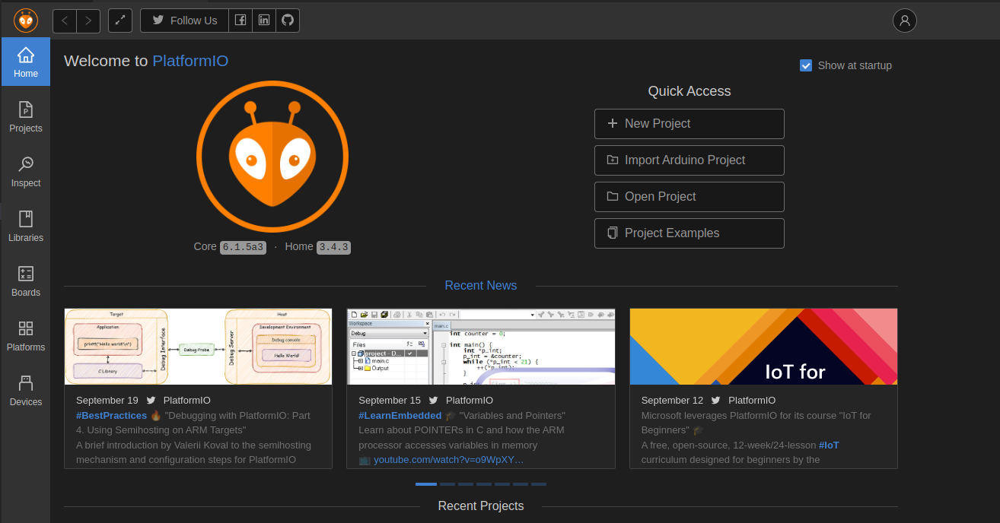
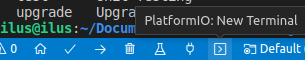
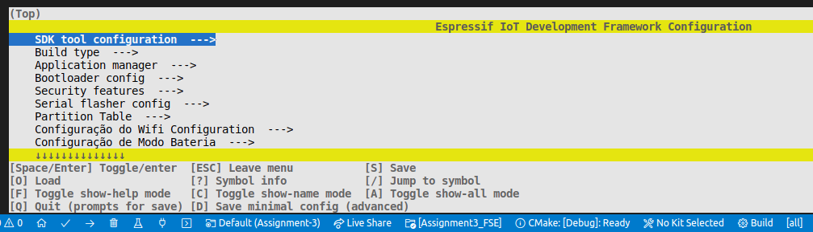
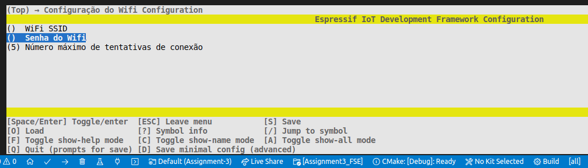
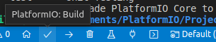
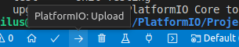
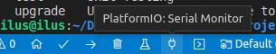

# Trabalho 3 - Fundamentos de Sistemas Embarcados

## Alunos
|Matrícula | Aluno |
| -- | -- |
| 170006328  |  Ariel Vieira Lima Serafim |
| 190106565  |  Fernando Miranda Calil |


## Objetivos

O objetivo deste trabalho é criar sensores e atuadores distribuídos baseados nos microcontroladores ESP32 interconectados via Wifi através do protocolo MQTT, podendo ser aplicada em diversos contextos de automação a exemplo das áreas de Automação Residencial, Predial ou Industrial.

Os microcontroladores ESP32 irão controlar a aquisição de dados de sensores, botões e chaves e acionar saídas como leds, dentre outras. Haverão dois modos de operação dos dispositivos: modo **energia** que representa o dispositivo ligado à tomada e modo **bateria** que representa o dispositivo que deverá operar em modo de baixo consumo.

Toda a comunicação será feita via rede Wifi com o protocolo MQTT e será provido um servidor central para cadastro e controle dos dispositivos através da plataforma [Thingsboard](https://thingsboard.io).


## Recursos utilizados

- **PlatformIO V. 6.1.5a3**
- **Espressif 32 V. 5.1.1**


## Utilização

Utilizando o editor de código [Visual Studio Code](https://code.visualstudio.com/), deve-se instalar a extensão [PlatformIO](https://platformio.org/install/ide?install=vscode).

Em seguida o projeto deve ser clonado através do comando

```
git@github.com:ArielSixwings/Assignment3_FSE.git
```

Após clonar o projeto, é preciso importa-lo como projeto para o workspace da extensão através do botão **Open Project** localizado na pagina da extensão.



Uma vez que o projeto já foi importado pelo PlatformIO, o usuário deverá inserir as credenciais de acesso a WIFI. Para isso, é necessário que o usuário acesse um terminal da framework do PlatformIO, isso pode ser feito através do botão de **New Terminal**.



No terminal é preciso inserir o comando

```
pio run -t menuconfig
```

Uma vez que o comando foi inserido corretamente, a tela de configurações deverá aparecer no terminal.



Dentro da tela de configurações é necessário escolher a opção de **Configuração do Wifi Configuration**, onde é preciso adicionar o nome da rede, através da opção **WiFi SSID** e a senha de acesso, através da opção **Senha WiFi**.




Após a configuração correta da rede Wifi, é preciso compilar o projeto através do botão de build, localizado na barra de status do editor de código.



Após a confirmação de sucesso no processo de compilação, é necessário fazer upload do executável para a placa, isso pode ser feito através do botão de upload.



Por fim o projeto pode ser executado através do botão Serial Monitor.



## Opções e Setup

É possível acionar o modo **Light Sleep** da placa através do menu de configurações. Para isso é preciso acessar o menu de configurações utilzando o comando:

```
pio run -t menuconfig
```

Em seguida, é preciso escolher a opção de **Configuração de Modo Bateria**, em seguida a opção de **Low Power Mode** pode assumir dois valores:

- **0**: O sistema funciona em modo Energia.
- **1**: O sistema entra em modo de ***low power***, ou modo Bateria.

## Vídeo

